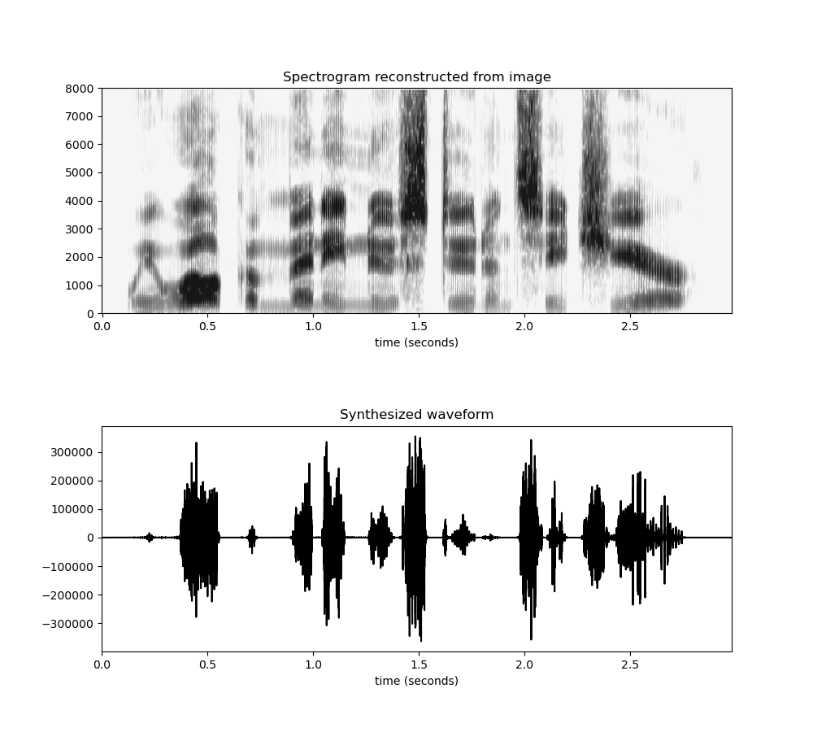

# A digital pattern playback system implemented in Python

The software converts images of magnitude spectrogram to sounds. Image of the spectrogram may be loaded from a file (e.g. png, jpg), cropped from the loaded file, or drawn from scratch on a blank canvas. The spectrogram is converted to waveform via inverse short-term Fourier transform using zero phase spectrum or the Griffin-Lim algorithm (Griffin & Lim, 1984). 

## How to cite

Koo, H. (2022). A digital pattern playback system implemented in Python. *Journal of the Acoustical Society of America, 151*(4), A132.

```bibtex
@article{koo_2022_asa_denver,
  title={A digital pattern playback system implemented in Python},
  author={Koo, Hahn},
  journal={Journal of the Acoustical Society of America},
  volume={151},
  number={4},
  pages={A132},
  year={2022},
  publisher={Acoustical Society of America}
}
```

## Usage

```
usage: python pattern_playback.py [-h] --duration DURATION --sampling_rate
                           SAMPLING_RATE [--load LOAD] [--crop] [--draw]
                           [--canvas_width CANVAS_WIDTH]
                           [--canvas_height CANVAS_HEIGHT]
                           [--canvas_margin CANVAS_MARGIN]
                           [--save_drawing SAVE_DRAWING] [--show_graphs]
                           [--griffinlim] [--save_wav SAVE_WAV]

optional arguments:
  -h, --help            show this help message and exit
  --duration DURATION
  --sampling_rate SAMPLING_RATE
  --load LOAD           image file to load (default: None)
  --crop                whether to crop from image (default: False)
  --draw                whether to draw a spectrogram on a blank canvas
                        (default: False)
  --canvas_width CANVAS_WIDTH
                        canvas width (default: 1200)
  --canvas_height CANVAS_HEIGHT
                        canvas height (default: 600)
  --canvas_margin CANVAS_MARGIN
                        canvas margin (default: 50)
  --save_drawing SAVE_DRAWING
                        save the spectrogram you drew on canvas as (default:
                        spectrogram.png)
  --show_graphs         whether to display the loaded spectrogram,
                        reconstructed waveform and its spectrogram (default:
                        False)
  --griffinlim          whether to use the Griffin-Lim algorithm to
                        reconstruct the waveform instead of assuming zero
                        phase (default: False)
  --save_wav SAVE_WAV   save the reconstructed waveform as (default: out.wav)
```

## Examples

- Loading image from a jpg file (from [here](https://splab.net/digital_pattern_playback/) and converting to waveform using the Griffin-Lim algorithm:

```
python pattern_playback.py --duration 3 --sampling_rate 16000 --load ./examples/example1.jpg --griffinlim --save_wav ./examples/example1.wav --show_graphs
```

> Input


> Output


<audio controls>
<source src="./examples/example1.mp3">
</audio>


- Cropping image from a png file (from Ladefoged & Johnson, 2014) and converting to waveform using the Griffin-Lim algorithm:

```
python pattern_playback.py --duration 0.4 --sampling_rate 8000 --load ./examples/example2.png --crop --griffinlim --save_wav ./examples/example2.wav --show_graphs
```

> Input


> Output


<audio controls>
<source src="./examples/example2.mp3">
</audio>

- Cropping image from a png file (from Cooper et al., 1952) and converting to waveform assuming zero phase spectrum:

```
python pattern_playback.py --duration 1.1 --sampling_rate 8000 --load ./examples/example4.png --crop --save_wav ./examples/example4.wav --show_graphs
```

> Input


> Output


<audio controls>
<source src="./examples/example4.mp3">
</audio>

- Drawing on a blank canvas (my attempt to recreate "salmon" in Cooper the figure above) and converting to waveform assuming zero phase spectrum:

```
python pattern_playback.py --duration 0.5 --sampling_rate 8000 --draw --save_drawing ./examples/example3.png --save_wav ./examples/example3.wav --show_graphs
```


> Input


> Output


<audio controls>
<source src="./examples/example3.mp3">
</audio>


## References

Cooper, F. S., Delattre, P. C., & Liberman, A. M. (1952). Some experiments on the perception of synthetic speech sounds. *Journal of the Acoustical Society of America, 24*(6), 597-606.

Griffin, D., & Lim, J. (1984). Signal estimation from modified short-time Fourier transform. *IEEE Transactions on Acoustics, Speech, and Signal Processing, 32*(2), 236-243.

Ladefoged, P., & Johnson, K. (2014). A Course in Phonetics. Cengage Learning.
